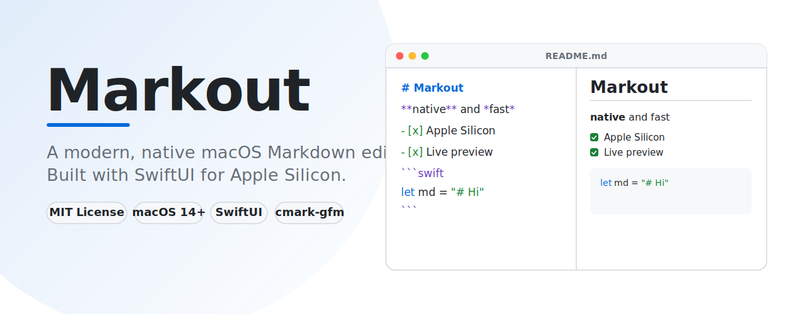
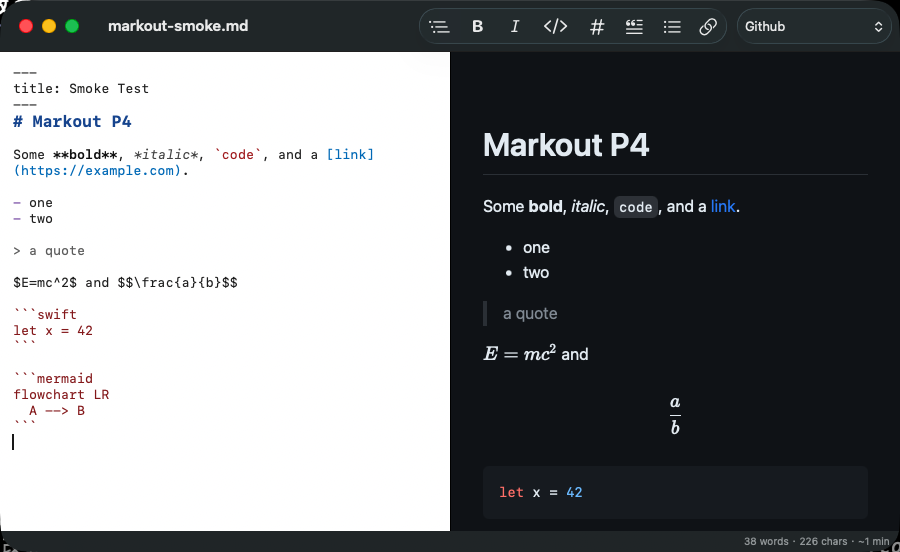

[English](README.md) · [繁體中文](README.zh-TW.md) · [简体中文](README.zh-CN.md) · 日本語 · [한국어](README.ko.md)

<picture>
  <source media="(prefers-color-scheme: dark)" srcset="assets/hero-dark.svg">
  
</picture>

# Markout

[](https://github.com/maxmilian/markout/releases/latest)
[](https://github.com/maxmilian/markout/actions/workflows/ci.yml)
[](LICENSE)


Markout は、Apple Silicon 向けのモダンでネイティブな macOS Markdown エディタです。メンテナンスが止まっている [MacDown](https://github.com/MacDownApp/macdown) の精神的後継を目指しています。

SwiftUI + TextKit + WKWebView で構築されています。構文、数式、図表エンジンは vendored されており、すべて **オフライン** で動作します。CDN には依存しません。ライセンスは MIT です。



## ダウンロード

### Homebrew

```sh
brew install --cask maxmilian/tap/markout
```

### または `.dmg` をダウンロード

**[⬇ 最新リリースをダウンロード](https://github.com/maxmilian/markout/releases/latest)** — または[ソースからビルド](#building)します。

1. ダウンロードした `Markout-*.dmg` を開き、**Markout** を**アプリケーション**フォルダにドラッグします。
2. 初回起動のみ：**Markout.app** を右クリック →「**開く**」→「**開く**」。

Markout はアドホック署名されていますが Apple の公証は受けていないため、初回起動時に macOS が Gatekeeper の警告を表示します。右クリック →「開く」で macOS に信頼させます。ダブルクリックで開けない場合は、ターミナルで一度だけ次を実行して隔離属性を解除してください：

```sh
xattr -cr /Applications/Markout.app
```

macOS 14 以降が必要です（Apple Silicon 推奨）。

## Why Markout

Markout は、macOS で高速なネイティブ Markdown エディタを使いたい人のためのアプリです。ファイルを開き、プレーンテキストで書き、すぐにプレビューし、文書を外部サービスへ送らずにエクスポートできます。

重視している点：

- Web アプリのラッパーではなく、ネイティブな macOS 体験
- Markdown、コードハイライト、数式、図表をすべてオフラインでレンダリング
- 親しみやすいエディタ / プレビュー分割ワークフロー
- 小さく理解しやすく、改善しやすい Swift コードベース

## Features

**Editing**
- 150 ms debounce の分割エディタ + ライブプレビュー
- 切り替え可能なエディタテーマ付き Markdown シンタックスハイライト
- リストの自動継続、画像のペースト / ドロップ（文書の隣に保存）
- 検索と置換、任意の行番号 gutter、soft wrap 切り替え
- フォーマットツールバーと **Format** メニュー（太字 ⌘B、斜体 ⌘I、リンク ⌘K、見出し、引用、リスト）。すべて undo 対応

**Preview**
- [cmark-gfm](https://github.com/apple/swift-cmark) による GitHub-Flavored Markdown
- [highlight.js](https://highlightjs.org) によるコードハイライト
- [KaTeX](https://katex.org) による TeX 数式：inline `$…$` と display `$$…$$`
- [Mermaid](https://mermaid.js.org) による図表
- エディタとプレビューのスクロール同期
- 切り替え可能なプレビューテーマとカスタム CSS
- システム設定に追従するライト / ダークモード

**Output and editing aids**
- スタンドアロン HTML、またはライブプレビューと一致する PDF へエクスポート
- 目次：文書へ挿入、またはサイドバーで閲覧
- YAML front matter 解析
- ライブの単語数 / 文字数 / 読了時間

**Preferences** (⌘,)：エディタのフォントサイズ、エディタテーマ、soft wrap、行番号、プレビューテーマ、カスタム CSS、単語数表示。

## Requirements

- macOS 14 以降
- Apple Silicon Mac 推奨
- Xcode
- [XcodeGen](https://github.com/yonaskolb/XcodeGen)

## Building

```sh
brew install xcodegen
xcodegen generate
xcodebuild -project Markout.xcodeproj -scheme Markout -destination 'platform=macOS' build
```

テストを実行：

```sh
xcodebuild test -project Markout.xcodeproj -scheme Markout -destination 'platform=macOS'
```

アーキテクチャメモは [`CLAUDE.md`](CLAUDE.md)、設計仕様と実装計画は [`docs/superpowers/`](docs/superpowers/) を参照してください。

## Project structure

```text
Sources/Markout/
├── App/          # SwiftUI app shell and document actions
├── Document/     # Markdown document model, front matter, pasted assets
├── Editor/       # TextKit editor, syntax highlighting, formatting helpers
├── Export/       # HTML and PDF export
├── Preview/      # WKWebView preview and scroll sync
├── Render/       # Markdown rendering, HTML template, preview themes
└── Settings/     # Preferences, editor themes, appearance resolution
```

Vendored preview assets は `Resources/PreviewAssets/`、テストは `Tests/MarkoutTests/` にあります。

## Status

4 段階の roadmap は完了しています：

- ✅ **P1 — Core MVP:** 分割エディタ + ライブプレビュー、GFM レンダリング、シンタックスハイライト、開く / 保存、ダークモード。
- ✅ **P2 — Rich content:** コードハイライト、KaTeX 数式、Mermaid 図表、スクロール同期、プレビューテーマ。
- ✅ **P3 — Output & editing:** HTML/PDF エクスポート、TOC、front matter、画像ペースト、検索と置換。
- ✅ **P4 — Polish:** Preferences、エディタテーマ、単語数、フォーマットツールバー。

## Localization

README は以下の言語で利用できます：

- [English](README.md)
- [繁體中文](README.zh-TW.md)
- [简体中文](README.zh-CN.md)
- [日本語](README.ja.md)
- [한국어](README.ko.md)

翻訳は英語 README と同じ技術的意味を保つ必要があります。機能が変わる場合は、まず英語 README を更新し、可能であれば同じ pull request で翻訳も更新してください。

## Contributing

バグ修正、エディタ改善、レンダリング修正、エクスポートの polish、ドキュメント、テスト、翻訳を歓迎します。

pull request を開く前に：

1. 変更を絞り、既存の SwiftUI / TextKit / WKWebView アーキテクチャに合わせてください。
2. `project.yml` を変更した場合は `xcodegen generate` を実行してください。
3. `xcodebuild test -project Markout.xcodeproj -scheme Markout -destination 'platform=macOS'` を実行してください。
4. ユーザーに見える挙動が変わる場合は、README または localized README を更新してください。

詳しくは [CONTRIBUTING.md](CONTRIBUTING.md) を参照してください。

## Acknowledgements

Markout は、長年愛用してきた Markdown エディタ [MacDown](https://github.com/MacDownApp/macdown) に多くを負っています。MacDown はメンテナンスが止まっているため、Markout は現代の Apple Silicon macOS 向けに完全ネイティブで作り直し、同じく高速・プレーンテキスト・オフラインの精神を受け継いでいます。MacDown の作者の皆さんに感謝します。

## License

[MIT License](LICENSE) のもとで公開されています。© 2026 maxmilian
